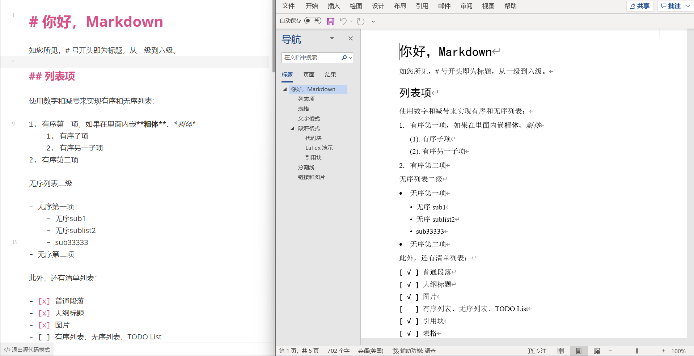

# Test Document

This is a test document for MarkDocx.

## Formatting

Here's some **bold** and *italic* text.

### Lists

- Item 1
- Item 2
  - Sub item 1
  - Sub item 2

1. First item
2. Second item
   1. Sub item 1
   2. Sub item 2

### Code

```python
def hello():
    print("Hello, World!")
```

### Table

| Header 1 | Header 2 |
|----------|----------|
| Cell 1   | Cell 2   |
| Cell 3   | Cell 4   |

### Links and Images

[Example Link](https://example.com)



> This is a blockquote.
> It can span multiple lines. 